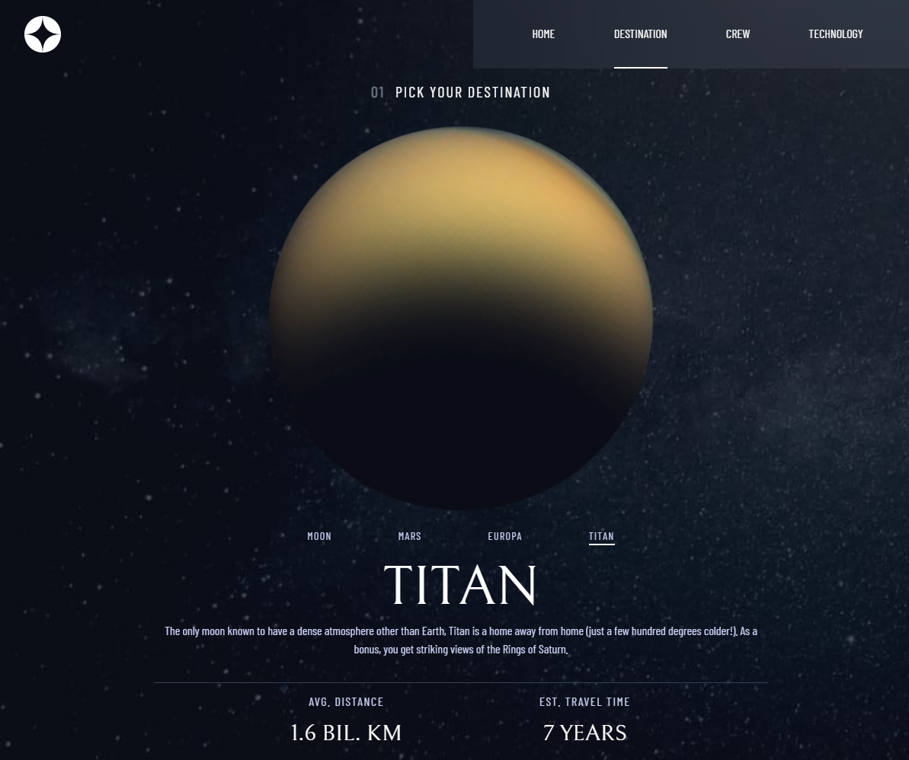

# Space Tourism Website

It is a practice project provided by [@FrontendMentor](https://www.frontendmentor.io/challenges/space-tourism-multipage-website-gRWj1URZ3). I tried to use this project as a refresher. At the same time, I focused on learning a new and useful library called framer motion.

## Table of contents

- [Overview](#overview)
  - [Screenshot](#screenshot)
- [My process](#my-process)
  - [Built with](#built-with)
  - [What I learned](#what-i-learned)
  - [Useful resources](#useful-resources)
- [Author](#author)

## Overview

### Screenshot

<table border=0>
 <tr >
    <td><b style="font-size:20px">Desktop</b></td>
 </tr>
 <tr>
		<td>
		1) Home Page
		
		</td>
		<td>
		2) Destination Page
		
		</td>
 </tr>
 <tr>
    <td>
		3) Crew Details Page
		
				</td>
    <td>
    	4) Tech Details Page
    	
				</td>
</tr>
</table>
<table border="0">
  <tr >
    <td width='70%'><b style="font-size:20px">Tablet</b></td>
    <td width='30%'><b style="font-size:20px">Mobile</b></td>
 </tr>
 <tr>
    <td>
		1) Home Page
	
	2) Destination Page

3) Crew Details Page

4) Tech Details Page

</td>
    <td>
		1) Home Page

2) Destination Page

3) Crew Details Page

4) Technology Page

5) Navbar Open

    	</td>

 </tr>
</table>

## My process

- Creating Mobile Designs:

1. Begin with the mobile design for the home page.
2. Move on to create mobile designs for the destination, crew, and technology pages.
3. Design the mobile version of the navigation bar (navbar).
4. Implement the required functionality for the mobile navbar.

- Tablet Design:

1. Adapt the page designs to match the tablet design.
2. Develop the navbar for tablet devices.
3. Ensure the tablet navbar is fully functional.

- Desktop Design:

1. Create the desktop version of the navbar.
2. Add the necessary functionality to the desktop navbar.
3. Implement animations and functionality to switch page contents.

### Built with

- React.js
- Tailwind CSS v3
- Flexbox
- Framer Motion
- CSS Grid
- Mobile-first workflow

### What I learned

I learned how to add the glassmorphism effect to components. Another thing I learned is about framer components like motion, and animatePresence.

### Useful resources

- [tailwindcss.com](https://tailwindcss.com/) - Tailwind CSS documentation
- [Framer Motion](https://www.framer.com/motion/) - Framer motion documentation (I would suggest playing around in the sandbox with a feature if you like it)

## Author

- Frontend Mentor - [@therahulchaurasia](https://www.frontendmentor.io/profile/therahulchaurasia)
- HackerRank - [@therahulchaurasia](https://www.hackerrank.com/therahulchauras1)
